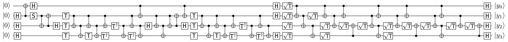

# Evaluating NISQ Devices with Quadratic Nonresidues
Documentation and files relevant to QIP2022 presentation

# Poster
<p align="center">
<a href="https://github.com/SmoothDragon/QIP2022_QNR/blob/main/QNR_poster.pdf" type="application/pdf">

</a>
</p>

# Read the preprint
[Evaluating NISQ Devices with Quadratic Nonresidues](https://arxiv.org/pdf/2110.09483.pdf)

# [Try out the circuit in QUIRK](https://algassert.com/quirk#circuit={%22cols%22:[[1,%22H%22,%22H%22,%22H%22],[%22X%22,%22%E2%80%A2%22],[%22H%22,%22Z^%C2%BD%22],[1,%22%E2%80%A2%22,%22X%22],[1,%22X%22,%22%E2%80%A2%22],[1,1,%22H%22],[1,%22Z^%C2%BC%22,%22Z^%C2%BC%22,%22Z^%C2%BC%22],[1,%22%E2%80%A2%22,%22X%22],[1,1,%22%E2%80%A2%22,%22X%22],[1,1,1,%22Z^%C2%BC%22],[1,%22%E2%80%A2%22,%22X%22],[1,1,%22%E2%80%A2%22,%22X%22],[1,1,1,%22Z^-%C2%BC%22],[1,%22%E2%80%A2%22,%22X%22],[1,1,%22Z^-%C2%BC%22],[1,1,%22%E2%80%A2%22,%22X%22],[1,1,1,%22Z^-%C2%BC%22],[1,%22%E2%80%A2%22,%22X%22],[1,1,%22%E2%80%A2%22,%22X%22],[%22%E2%80%A2%22,%22X%22],[1,1,%22H%22],[1,%22%E2%80%A2%22,%22X%22],[1,1,%22%E2%80%A2%22,%22X%22],[1,%22%E2%80%A2%22,%22X%22],[1,%22X%22,%22%E2%80%A2%22],[%22%E2%80%A2%22,%22X%22],[1,1,%22H%22],[1,%22Z^%C2%BC%22,%22Z^%C2%BC%22,%22Z^%C2%BC%22],[1,%22%E2%80%A2%22,%22X%22],[1,1,%22%E2%80%A2%22,%22X%22],[1,1,1,%22Z^%C2%BC%22],[1,%22%E2%80%A2%22,%22X%22],[1,1,%22%E2%80%A2%22,%22X%22],[1,1,1,%22Z^-%C2%BC%22],[1,%22%E2%80%A2%22,%22X%22],[1,1,%22Z^-%C2%BC%22],[1,1,%22%E2%80%A2%22,%22X%22],[1,1,1,%22Z^-%C2%BC%22],[1,%22%E2%80%A2%22,%22X%22],[1,1,%22%E2%80%A2%22,%22X%22],[%22H%22,%22H%22,1,%22H%22],[%22~qcp4%22,%22~qcp4%22,%22~qcp4%22,%22~qcp4%22],[%22%E2%80%A2%22,%22X%22],[1,%22%E2%80%A2%22,%22X%22],[1,1,%22%E2%80%A2%22,%22X%22],[1,%22~qcp4%22,%22~qcp4%22,%22~qcp4%22],[%22%E2%80%A2%22,%22X%22],[1,%22%E2%80%A2%22,%22X%22],[1,1,%22~qcp4%22],[1,1,%22X%22,%22%E2%80%A2%22],[1,1,%22~qcp4%22],[%22%E2%80%A2%22,%22X%22],[1,%22%E2%80%A2%22,%22X%22],[1,1,%22%E2%80%A2%22,%22X%22],[1,1,%22~qcp4%22,%22~qcp4%22],[%22%E2%80%A2%22,%22X%22],[1,%22%E2%80%A2%22,%22X%22],[1,1,%22~qcp4%22],[1,1,%22X%22,%22%E2%80%A2%22],[1,1,%22~qcp4%22],[%22%E2%80%A2%22,%22X%22],[1,%22%E2%80%A2%22,%22X%22],[1,1,%22%E2%80%A2%22,%22X%22],[%22%E2%80%A2%22,%22X%22],[1,1,%22~qcp4%22],[1,%22%E2%80%A2%22,%22X%22],[1,1,%22~qcp4%22],[1,1,%22X%22,%22%E2%80%A2%22],[%22H%22,%22H%22,%22H%22,%22H%22]],%22gates%22:[{%22id%22:%22~qcp4%22,%22matrix%22:%22{{1,0},{0,0.9238795+0.3826834i}}%22},{%22id%22:%22~g9h%22,%22matrix%22:%22{{1,0},{0,0.9238795-0.3826834i}}%22}]})


All circuit images created using [qpic](https://github.com/qpic/qpic).

# QASM code
```
OPENQASM 2.0;
include "qelib1.inc";

qreg q[4];
creg c[4];

h q[1];
h q[2];
h q[3];
# h q[0];
cx q[1],q[0];
h q[0];
s q[1];
cx q[1],q[2];
cx q[2],q[1];
h q[2];
t q[1];
t q[2];
t q[3];
cx q[1],q[2];
cx q[2],q[3];
t q[3];
cx q[1],q[2];
cx q[2],q[3];
tdg q[3];
cx q[1],q[2];
tdg q[2];
cx q[2],q[3];
tdg q[3];
cx q[1],q[2];
cx q[2],q[3];
cx q[0],q[1];
h q[2];
cx q[1],q[2];
cx q[2],q[3];
cx q[1],q[2];
cx q[2],q[1];
cx q[0],q[1];
h q[2];
t q[1];
t q[2];
t q[3];
cx q[1],q[2];
cx q[2],q[3];
t q[3];
cx q[1],q[2];
cx q[2],q[3];
tdg q[3];
cx q[1],q[2];
tdg q[2];
cx q[2],q[3];
tdg q[3];
cx q[1],q[2];
cx q[2],q[3];
h q[0];
h q[1];
h q[3];
rz(pi/8) q[0];
rz(pi/8) q[1];
rz(pi/8) q[2];
rz(pi/8) q[3];
cx q[0],q[1];
cx q[1],q[2];
cx q[2],q[3];
rz(pi/8) q[1];
rz(pi/8) q[2];
rz(pi/8) q[3];
cx q[0],q[1];
cx q[1],q[2];
rz(pi/8) q[2];
cx q[3],q[2];
rz(pi/8) q[2];
cx q[0],q[1];
cx q[1],q[2];
cx q[2],q[3];
rz(pi/8) q[2];
rz(pi/8) q[3];
cx q[0],q[1];
cx q[1],q[2];
rz(pi/8) q[2];
cx q[3],q[2];
rz(pi/8) q[2];
cx q[0],q[1];
cx q[1],q[2];
cx q[2],q[3];
rz(pi/8) q[2];
cx q[0],q[1];
cx q[1],q[2];
rz(pi/8) q[2];
cx q[3],q[2];
h q[0];
h q[1];
h q[2];
h q[3];
measure q[0] -> c[0];
measure q[1] -> c[1];
measure q[2] -> c[2];
measure q[3] -> c[3];
```
